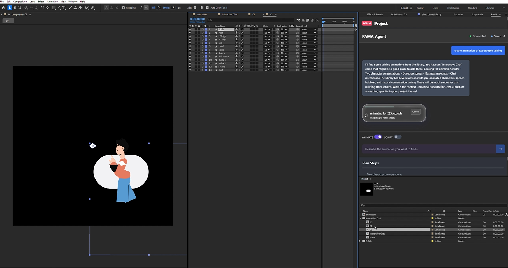

<div align="center">

# PAMA: **P**roject **A**wareness **M**ulti-Model **A**gent
**The Ultimate Offline-First Lottie Search Engine & Importer for After Effects**

[](https://opensource.org/licenses/MIT)
[]()
[]()
[]()
[]()

<p align="center">
  <b>PAMA is a massively advanced, offline-capable search engine and native Lottie-to-Shape-Layer compiler built directly into the Adobe CEP environment.</b>
</p>

<div align="center">



<br/>

https://github.com/nishantmulchandani/PAMA/raw/main/pama_demo.mp4

*Click the video above to see PAMA live in action!*
</div>
</div>

---

## 🌟 The Vision: Why PAMA Exists

Most After Effects plugins rely heavily on cloud processing, pinging corporate servers every time you want to search an asset. Furthermore, standard Lottie importers simply drop a flattened pre-comp into your timeline.

**PAMA is completely different.**

Currently, PAMA serves as an incredibly powerful **local search engine and importer**. It runs entirely offline, parses Lottie schemas natively using a custom ExtendScript compiler, and utilizes lightweight local AI models solely to understand the *meaning* of your searches (Semantic Vector Search). 

While the ultimate goal of "Project Awareness Multi-Model Agent" is to introduce autonomous AI generation directly on your timeline, **the current release focuses purely on perfecting local search, asset management, and mathematically native shape-layer compilation.**

## 🚀 Core Technologies In The Current Release

### 1. 🔍 Advanced Hybrid Semantic Search (`server/search.js`)
We dumped standard keyword searching. PAMA integrates an incredibly powerful hybrid search engine running entirely offline inside Node.js.
- **Dense Vector Embeddings:** Uses local `@xenova/transformers` (BGE-Small models) to understand semantic context. Ask for "a vessel to keep water hot," and the engine returns "Thermos" animations by understanding the words mathematically using **HNSW** vector indices (`usearch`).
- **Sparse Keyword Fallback:** Utilizes `flexsearch` to immediately return exact filenames and tags.
- **Reciprocal Rank Fusion (RRF):** Intelligently combines vector and keyword search results in real-time. *(Read `SEARCH_ARCHITECTURE.md` for our full engineering paper).*

### 2. 🛠️ Native Lottie ExtendScript Compiler (`jsx/importers/lottieImporter.jsx`)
Instead of downloading a `.json` schema and converting it to a video, our custom Bodymovin compiler natively reads the Lottie schema JSON and systematically recreates it from scratch inside After Effects.
- Dynamically generates `addShape()`, `addText()`, `addSolid()`.
- Calculates structural Spatial Tangents, Bezier Interpolations (`KeyframeInterpolationType`), and Temporal Easing (`KeyframeEase`) algorithmically.
- You get 100% native, mathematically precise local After Effects shape layers and keyframes exactly as they were fundamentally designed.

### 3. ⚡ Modern React 18 Architecture (`client/src`)
The UI is a completely decoupled, ultra-fast React 18 frontend communicating with the local Node.js server via WebSockets (`Socket.IO`).
- Styled perfectly with **TailwindCSS** for a responsive, modern Dark Mode aesthetic that matches Adobe's design language.
- Real-time import tracking, error handling, and visual previews.

### 4. 🧠 Foundation For Project Awareness (`server/agent.js`)
Currently, the extension actively scans your active composition, reading layers and footage metadata, and saves it to a highly concurrent local SQLite memory base. This structural data is the hidden foundation for our future AI-generation roadmap.

---

## 📦 Local Installation

To run this tool, you install it directly as an Adobe CEP extension.

1. Download or clone this repository to your computer.
2. Place the unzipped folder into your Adobe CEP extensions directory:
   - **Windows:** `C:\Users\<YourUsername>\AppData\Roaming\Adobe\CEP\extensions\`
   - **Mac:** `~/Library/Application Support/Adobe/CEP/extensions/`
3. Because this relies heavily on local Node environments, you must enable `PlayerDebugMode` in your system registry (Windows) or plist (Mac) to load unsigned extensions into Adobe products.
4. Restart After Effects.
5. Launch the tool via **Window > Extensions > PAMA**.

> **Note on Privacy:** PAMA has no external cloud telemetry. Out of the box, it is a 100% offline visual library.

---

## 👨‍💻 Developer Guide: How to Work With It

Since PAMA is a full-stack local application embedded in a CEP panel, you must build the client and start the local server when altering the source code.

### 1. Start the Node.js Server (Backend/AI Search Engine)
PAMA's AI Search, SQLite Database, and ExtendScript Gateway run locally. You can boot it from the root directory using the included wrapper:
```bash
npm install --prefix server
node start-server.js
```
*(Keep this terminal running during development to process background searches and imports).*

### 2. Build the React Client (Frontend)
The visual extension inside After Effects is built with React 18 and TailwindCSS.
```bash
cd client
npm install
npm run build
```
*(This compiles the UI payload into `/client` which the Adobe panel loads directly).*

### 3. Load the Extension
With the server running and the client built, open After Effects and navigate to **Window > Extensions > PAMA**. Note: Due to Chromium Embedded Framework caching, you may need to clear your CEP cache or reload the panel during hot development.

---

## 🗺️ The Roadmap (The Multi-Modal AI Future)

PAMA is currently a world-class Lottie search and import engine, but our namesake is the **Multi-Model Agent**. We are actively seeking contributors to help us unlock the AI generation:

- [ ] **Live AI Lottie Generation:** Connect our currently stubbed `agent.js` architecture to local stable diffusion or prompt-to-Lottie reasoning models. The goal: Type a prompt, and PAMA outputs the raw `.json` schema algorithmically.
- [ ] **AI-Driven Timeline Automation:** Re-enable the Planner-Critic loop (currently offline) to accept natural language prompts from the UI, allowing users to ask PAMA to automate complex, multi-comp tasks via LLM-generated ExtendScript.
- [ ] **Live Folder HNSW Indexing:** Make the server watch a designated `Downloads` folder, automatically tokenize any new Lottie files, calculate the Dense Vectors using Transformers.js, and inject them into the local SQLite memory base instantly.
- [ ] **Auto-Color Context Injection:** Intercept the compilation importer to recolor the Lottie layers algorithmically based on your active comp's palette before drawing them.

---

## 🤝 Contributing
If you are an engineer passionate about Machine Learning, React, or Adobe Automation (ExtendScript), we want you. PAMA is highly modular. You can work purely on the React UI, the Express data-pipelines, or the ExtendScript compiler independently. Fork the repo, read the `SEARCH_ARCHITECTURE.md`, and submit a Pull Request.

## 📜 License
Distributed under the MIT License. See `LICENSE` for more information.

---
*Built with ❤️ for the global motion design community.*
